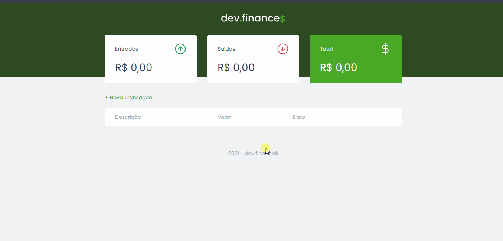

# Dev-finance

<h1 align="center">

</h1>

 Esse foi um projeto desenvolvido durante a maratona discovery promovida pela rocketseat.

<h2 align="center"> Sobre o projeto </h2>

 O projeto consiste em uma aplicação web front-end onde a ideia é ter um controle dos gastos colocando seus ganhos e gastos. 

<h2 align="center"> Tecnologias utilizadas </h2>

 O projeto foi feito utilizando as 3 tecnologias bases do front-end que são: HTML, CSS e Javascript. 

 O javascript foi responsável por manipular a dom, fazer os cálculos matemáticos, salvar no localStorage do navegador os dados inseridos para que não sejam perdidos quando o usuário sair da página e recuperar esses dados ao entrar. 

<h2 align="center"> Bônus </h2>

 Como bônus, acrescentei uma função para deixar o total com background-color vermelhor caso o mesmo esteja com valor negativo. 
 

 Com os novos conhecimentos adquiridos durante a criação desse projeto, fiz uma aplicação de lista de tarefas que pode ser conferida no link a seguir:
<a href="https://github.com/Hamilton-junior/Todo-list">Lista de tarefas </a>

<h2 align="center"> Agradecimentos </h2>

 Toda equipe da Rocketseat por disponibilizar esse tipo de conhecimento gratuitamente para a comunidade dev. 

<h2 align="center"> Autor </h2>
<strong> Hamilton de Souza </strong>
 

